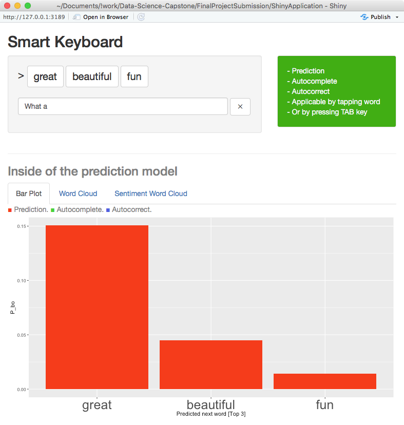
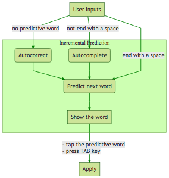
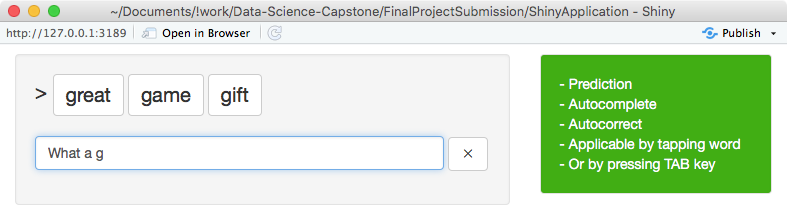

Smart Keyboard App
========================================================
author: Koji
date: Aug 6, 2018
autosize: true
transition: rotate

------------

Introduction and Goal
========================================================

Introduction
-------------
- The goal of this project is to build an interactive Shiny application that can predict the next word following a phrase of input text.
- We used N-gram model and the "Katz's Back-off" model with "Good Turing Estimate" smoothing.
- We downsample and use a dataset from a corpus called HC Corpora

Links
-------------
- [Smart Keyboard App](https://dr-orange-jr.shinyapps.io/SmartKeyboardApp/)
- [GitHub repo](https://github.com/dr-orange/Data-Science-Capstone/tree/master/FinalProjectSubmission/ShinyApplication)

Predicitive Model Algorithm
========================================================
- **Prediction** - Apply "Katz's Back-off" model and "Good Turing Estimate" smoothing with saved parameters.
- **Autocomplete** - Apply the model using the previous word. And output the candidate words by matching the characters.
- **Autocorrect** - If no N-gram is matched, calculate the word distance to all 1-gram. Apply the model with the nearest word and predict next word.

 

Quantitative Predictive Performance
========================================================
We used blogs and twitter (no news) data set of 3.5% Train(2,369,310 words), 0.06% Test(23,923 words). 

**Efficiency:** <0.1 sec each prediction
-------------

**Accuracy:**  21.4% accuracy
-------------
which the top 3 candidates have correct word.

**Perplexity:** 2864 Test / 63.2 Train
-------------

**Memory Usage:** 350.5 Mb
-------------

**Experience:**  30% less typing time.
-------------

Save your typing time.
========================================================
[Smart Keyboard Shiny App](https://dr-orange-jr.shinyapps.io/SmartKeyboardApp/)
-------------
- Fast & Inclemental Prediction
- Autocomplete
- Autocorrect
- Applicable by tapping word or by pressing TAB key

