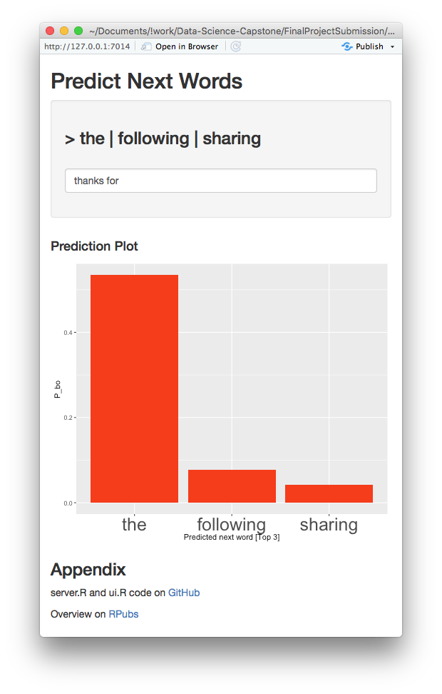

```{r setup, include=FALSE}
knitr::opts_chunk$set(echo = TRUE)
Sys.setlocale(category = "LC_TIME", locale = "C")
```

# Project Overview

Around the world, people are spending an increasing amount of time on their mobile devices for email, social networking, banking and a whole range of other activities. But typing on mobile devices can be a serious pain. SwiftKey, our corporate partner in this capstone, builds a smart keyboard that makes it easier for people to type on their mobile devices. One cornerstone of their smart keyboard is predictive text models. When someone types:

I went to the

the keyboard presents three options for what the next word might be. For example, the three words might be gym, store, restaurant. In this capstone you will work on understanding and building predictive text models like those used by SwiftKey.

# Goal
The goal of this exercise is to create a product to highlight the prediction algorithm that you have built and to provide an interface that can be accessed by others. For this project you must submit:

1. A Shiny app that takes as input a phrase (multiple words) in a text box input and outputs a prediction of the next word.
2. A slide deck consisting of no more than 5 slides created with R Studio Presenter (https://support.rstudio.com/hc/en-us/articles/200486468-Authoring-R-Presentations) pitching your algorithm and app as if you were presenting to your boss or an investor.

_Review criteria_

### Data Product

- Does the link lead to a Shiny app with a text input box that is running on shinyapps.io?
- Does the app load to the point where it can accept input?
- When you type a phrase in the input box do you get a prediction of a single word after pressing submit and/or a suitable delay for the model to compute the answer?
- Put five phrases drawn from Twitter or news articles in English leaving out the last word. Did it give a prediction for every one?

### Slide Deck

- Does the link lead to a 5 slide deck on R Pubs?
- Does the slide deck contain a description of the algorithm used to make the prediction?
- Does the slide deck describe the app, give instructions, and describe how it functions?
- How would you describe the experience of using this app?
- Does the app present a novel approach and/or is particularly well done?
- Would you hire this person for your own data science startup company?

```{r, message=FALSE, warning=FALSE}
library(stringr)
library(dplyr)
library(quanteda)
library(readtext)
library(R.utils)
library(ggplot2)

set.seed(3301)
```

## Download Data
```{r}
downloadData <- function(workingDataPath = file.path("data")) {
        # Download Data
        rawDataFileUrl <- "https://d396qusza40orc.cloudfront.net/dsscapstone/dataset/Coursera-SwiftKey.zip"
        downloadedZipfilePath <- file.path(workingDataPath, "Coursera-SwiftKey.zip")
        badWordsFileUrl <- "https://www.cs.cmu.edu/~biglou/resources/bad-words.txt"
        badWordsFilePath <- file.path(workingDataPath, "bad-words.txt")
        basePath <- file.path(workingDataPath, "final", "en_US")
        
        # Create working directory
        if(!file.exists(workingDataPath)) {
                dir.create(workingDataPath)
        }
        # Download ziped file
        if(!file.exists(downloadedZipfilePath)) {
                download.file(rawDataFileUrl, destfile = downloadedZipfilePath, method = "curl")
        }
        # Download Bad Words Text File
        if(!file.exists(badWordsFilePath)) {
                download.file(badWordsFileUrl, destfile = badWordsFilePath, method = "curl")
        }
        # Unzip
        if(!file.exists(basePath)) {
                unzip(zipfile = downloadedZipfilePath, exdir = workingDataPath)
        }
        
        list(blogs = file.path(basePath, "en_US.blogs.txt"), 
             twitter = file.path(basePath, "en_US.twitter.txt"),
             news = file.path(basePath, "en_US.news.txt"),
             badwords = badWordsFilePath)
}

dataPath <- file.path("..", "data")
attach(downloadData(dataPath))
c(blogs, twitter, news, badwords)
```

## Sub-Sampling
Since the original data is very large and takes time to analyse, it samples to 1% of data.
```{r sampling}
subSample <- function(input, output) {
        if(!file.exists(output)) {
                subSamplingRate <- .02
                fileLines <- as.numeric(countLines(input))
                flipABiasedCoin <- rbinom(fileLines, size = 1, prob = subSamplingRate)
                conRead <- file(input, "r")
                conWrite <- file(output, "w")
                len <- 0
                while (length(oneLine <- readLines(conRead, 1, warn = FALSE)) > 0) {
                        len <- len + 1
                        if(flipABiasedCoin[len] == 1) {
                                writeLines(oneLine, conWrite)
                        }
                }
                close(conRead)
                close(conWrite)
        }
        return(as.numeric(countLines(output)))
}

blogsSubSampling <- file.path(dataPath, "sub-sample.blogs.txt")
subBlogs <- subSample(blogs, blogsSubSampling)

twitterSubSampling <- file.path(dataPath, "sub-sample.twitter.txt")
subTweets <- subSample(twitter, twitterSubSampling)

newsSubSampling <- file.path(dataPath, "sub-sample.news.txt")
subNews <- subSample(news, newsSubSampling)

c(subBlogs, subTweets, subNews)
```

## Train and Test Data
Divide the sampled data into a training set and a test set at a ratio of 7: 3.
```{r traindata}
devideDataset <- function(input, outputTrain, outputTest) {
        if(!file.exists(outputTrain) || !file.exists(outputTest)) {
                trainRate <- .7
                fileLines <- as.numeric(countLines(input))
                flipABiasedCoin <- rbinom(fileLines, size = 1, prob = trainRate)
                conRead <- file(input, "r")
                conWriteTrain <- file(outputTrain, "w")
                conWriteTest <- file(outputTest, "w")
                len <- 0
                while (length(oneLine <- readLines(conRead, 1, warn = FALSE)) > 0) {
                        len <- len + 1
                        if(flipABiasedCoin[len] == 1) {
                                writeLines(oneLine, conWriteTrain)
                        } else {
                                writeLines(oneLine, conWriteTest)
                        }
                }
                close(conRead)
                close(conWriteTrain)
                close(conWriteTest)
        }
        return(as.numeric(countLines(outputTrain)))
}

blogsTrain <- paste0(blogsSubSampling, ".train.txt")
blogsTest <- paste0(blogsSubSampling, ".test.txt")
twitterTrain <- paste0(twitterSubSampling, ".train.txt")
twitterTest <- paste0(twitterSubSampling, ".test.txt")
newsTrain <- paste0(newsSubSampling, ".train.txt")
newsTest <- paste0(newsSubSampling, ".test.txt")

trainBlogs <- devideDataset(blogsSubSampling, blogsTrain, blogsTest)
trainTweets <- devideDataset(twitterSubSampling, twitterTrain, twitterTest)
trainNews <- devideDataset(newsSubSampling, newsTrain, newsTest)

c(trainBlogs, trainTweets, trainNews)
```

## Load Data
Loading files using the **readtext** package and make corpus using the **quanteda** package.
```{r tokenize}
projectCorpus <- readtext(blogsTrain) %>% corpus()
projectCorpus <- projectCorpus + readtext(twitterTrain) %>% corpus()
projectCorpus <- projectCorpus + readtext(newsTrain) %>% corpus()
```

## Load Bad Words
```{r badwords}
profanity <- readLines(badwords)
```

## 1-Gram
```{r top20_1}
projectToken <- projectCorpus %>% 
        # nomarize words
        tokens(remove_punct = TRUE,
               remove_numbers = TRUE,
               remove_url = TRUE,
               include_docvars = FALSE) %>%
        # removing profanity and other words
        tokens_remove(profanity)

projectDfm <- projectToken %>% 
        dfm()
```

## 2-Gram
```{r, fig.width=14, fig.height=14}
projectDfm2Gram <- projectToken %>%
        tokens_ngrams(n = 2) %>%
        dfm()
```

## 3-Gram
```{r, fig.width=14, fig.height=14}
projectDfm3Gram <- projectToken %>%
        tokens_ngrams(n = 3) %>%
        dfm()
```

# Modeling

Concept implementation.

## Good Turing Estimation
```{r}
simpleGoodTuring <- function(r, Nr, sd = 1.65) {
        # number of words
        N <- sum(r * Nr)
        d <- diff(r)
    
        ## Turing estimate
        # turing estimate index
        ti <- which(d == 1)
        # discount coefficients of Turing estimate
        dct <- numeric(length(r))
        dct[ti] <- (r[ti] + 1) / r[ti] * c(Nr[-1], 0)[ti] / Nr[ti]

        ## Linear Good-Turing estimate
        Zr <- Nr / c(1, 0.5 * (d[-1] + d[-length(d)]), d[length(d)])
        f <- lsfit(log(r), log(Zr))
        coef <- f$coef
        # corrected term frequency
        rc <- r * (1 + 1 / r)^(1 + coef[2])  
        # discount coefficients of Linear Good-Turing estimate
        dclgt <- rc / r

        ## make switch from Turing to LGT estimates
        # standard deviation of term frequencies between 'r' and 'rc' (?)
        rsd <- rep(1,length(r))        
        rsd[ti] <- (seq_len(length(r))[ti] + 1) / Nr[ti] * sqrt(Nr[ti + 1] * (1 + Nr[ti + 1] / Nr[ti]))
        
        dc <- dct
        for (i in 1:length(r)) {
            if (abs(dct[i] - dclgt[i]) * r[i] / rsd[i] <= sd) {
                dc[i:length(dc)] <- dclgt[i:length(dc)]
                break
            }
        }

        ## renormalize the probabilities for observed objects
        # summation of probabilities
        sump <- sum(dc * r * Nr) / N
        # renormalized discount coefficients
        dcr <- (1 - Nr[1] / N) * dc / sump
        
        # term frequency
        tf <- c(Nr[1] / N, r * dcr)
        p <- c(Nr[1] / N, r * dcr / N)
        names(p) <- names(tf) <- c(0, r)        
        
        list(p = p, r = tf)
}
```

## PreProcess Smoothing parameter
```{r}
sgtFactory <- function() {
        NrTbl1 <- textstat_frequency(projectDfm) %>%
                select(frequency) %>%
                mutate(freqOfFrequency = 1) %>%
                group_by(frequency) %>%
                summarise_all(sum)
        
        SGT1 <- simpleGoodTuring(NrTbl1$frequency, NrTbl1$freqOfFrequency)
        
        NrTbl2 <- textstat_frequency(projectDfm2Gram) %>%
                select(frequency) %>%
                mutate(freqOfFrequency = 1) %>%
                group_by(frequency) %>%
                summarise_all(sum)
        
        SGT2 <- simpleGoodTuring(NrTbl2$frequency, NrTbl2$freqOfFrequency)

        NrTbl3 <- textstat_frequency(projectDfm3Gram) %>%
                select(frequency) %>%
                mutate(freqOfFrequency = 1) %>%
                group_by(frequency) %>%
                summarise_all(sum)
        
        SGT3 <- simpleGoodTuring(NrTbl3$frequency, NrTbl3$freqOfFrequency)
        
        c(
                dUnigram = function(freq) {
                        SGT1$p[as.character(freq)]
                },
                dBigram = function(freq) {
                        SGT2$r[as.character(freq)] / freq
                },
                dTrigram = function(freq) {
                        SGT3$r[as.character(freq)] / freq
                }
        )
}

SGT <- sgtFactory()
```

## Parameters using our predict model
```{r}
predictModel <- c(SGT = SGT, 
                  trigram = projectDfm3Gram,
                  bigram = projectDfm2Gram,
                  unigram = projectDfm)
# save(predictModel, file = "predictModel.rda")
remove(projectDfm3Gram, projectDfm2Gram, projectDfm, SGT, projectCorpus, projectToken)
```

## 3-gram Model using Katz's back-off
```{r}
nextWords <- function(input, predictModel, outputs = 3, k = 0) {
        # k is the least important of the parameters. It is usually chosen to be 0.
        # However, empirical testing may find better values for k.
        inputs <- str_split(input, "\\s+")[[1]]
        inputsSize <- length(inputs)
        if (inputsSize > 1) {
                preTriGram <- paste(inputs[inputsSize - 1],
                                 inputs[inputsSize],
                                 sep = "_")

                nextWordDfm <- dfm_select(predictModel$trigram, 
                                          paste0(preTriGram, "_*"))
        } else {
                if (inputs == "") { return() }
                nextWordDfm <- NULL
        }
        preBiGram <- inputs[inputsSize]

        # extract n-gram that starts with input
        featuresNextWord <- NULL

        if (length(nextWordDfm) > k) {
                prevWordDfm <- dfm_select(predictModel$bigram,
                                          phrase(preTriGram))

                prevWordFreq <- textstat_frequency(prevWordDfm)$frequency

                # data frame
                featuresNextWord <-
                        textstat_frequency(nextWordDfm) %>%
                        mutate(p_bo = as.vector(predictModel$SGT.dTrigram(frequency) * frequency / prevWordFreq))

                # human readable outputs
                featuresNextWord$feature <-
                        sapply(as.vector(featuresNextWord$feature),
                               function(x) {
                                       str_split(x, "_")[[1]][3]
                               })
                
                # Sort by reverse frequency order
                featuresNextWord$feature <-
                        with(featuresNextWord,
                             reorder(feature,-p_bo))
                
        } else {
                nextWordDfm <- dfm_select(predictModel$bigram,
                                          paste0(preBiGram, "_*"))

                if (length(nextWordDfm) > k) {
                        prevWordDfm <- dfm_select(predictModel$unigram,
                                                  phrase(preBiGram))
                        prevWordFreq <- textstat_frequency(prevWordDfm)$frequency
        
                        # data frame
                        featuresNextWord <-
                                textstat_frequency(nextWordDfm) %>%
                                mutate(p_bo = as.vector(predictModel$SGT.dBigram(frequency) * frequency / prevWordFreq))

                        alpha <- 1 / sum(featuresNextWord$p_bo)
                        featuresNextWord %>%
                                mutate(p_bo = alpha * p_bo)

                        # human readable outputs
                        featuresNextWord$feature <-
                                sapply(as.vector(featuresNextWord$feature),
                                       function(x) {
                                               str_split(x, "_")[[1]][2]
                                       })
                        
                        # Sort by reverse frequency order
                        featuresNextWord$feature <-
                                with(featuresNextWord,
                                     reorder(feature,-p_bo))
                        
                } else {
                        nextWordDfm <- predictModel$unigram
                        prevWordFreq <- length(nextWordDfm)
                        

                        featuresNextWord <-
                                textstat_frequency(nextWordDfm) %>%
                                mutate(p_bo = as.vector(predictModel$SGT.dUnigram(frequency) * frequency / prevWordFreq))
        
                        alpha <- 1 / sum(featuresNextWord$p_bo)
                        featuresNextWord %>%
                                mutate(p_bo = alpha * p_bo)

                        # Sort by reverse frequency order
                        featuresNextWord$feature <-
                                with(featuresNextWord,
                                     reorder(feature,-p_bo))
                                
                }
        }
        if (outputs > 0) {
                featuresNextWord %>% slice(1:outputs)
        } else {
                featuresNextWord
        }
}

```

## I went to be
```{r}
# load("predictModel.rda")

ggplot(nextWords("I went to be", predictModel), aes(x = feature, y = p_bo)) +
        geom_bar(stat = "identity") + 
        xlab("Predicted next word") + ylab("P_bo")
```

```{r}
system.time(nextWords("I went to be", predictModel))
```


# Task 4: Prediction Model

The goal of this exercise is to build and evaluate your first predictive model. You will use the n-gram and backoff models you built in previous tasks to build and evaluate your predictive model. The goal is to make the model efficient and accurate.

_Tasks to accomplish_

1. Build a predictive model based on the previous data modeling steps - you may combine the models in any way you think is appropriate.
2. Evaluate the model for efficiency and accuracy - use timing software to evaluate the computational complexity of your model. Evaluate the model accuracy using different metrics like perplexity, accuracy at the first word, second word, and third word.

_Questions to consider_


1. How does the model perform for different choices of the parameters and size of the model?
2. How much does the model slow down for the performance you gain?
3. Does perplexity correlate with the other measures of accuracy?
4. Can you reduce the size of the model (number of parameters) without reducing performance?

```{r}
system.time(
        dfm_select(predictModel$trigram, "thanks_for_*")
)
```


## Perplexity

Implement **perplexity** function and compare accuracy.
```{r}
perplexity <- function(input, predictModel, outputs = 3, k = 0) {
        nextWord <- nextWords(input, predictModel, outputs = 0)
        p <- nextWord$p_bo
        N <- length(nextWord$p_bo)

        prod(1 / p^(1 / N))
}
```

```{r}
perplexity("I love", predictModel)
```
```{r}
perplexity("love", predictModel)
```

# Task 5: Creative Exploration

So far you have used basic models to understand and predict words. In this next task, your goal is to use all the resources you have available to you (from the Data Science Specialization, resources on the web, or your own creativity) to improve the predictive accuracy while reducing computational runtime and model complexity (if you can). Be sure to hold out a test set to evaluate the new, more creative models you are building.

_Tasks to accomplish_

1. Explore new models and data to improve your predictive model.
2. Evaluate your new predictions on both accuracy and efficiency.

_Questions to consider_

1. What are some alternative data sets you could consider using?
2. What are ways in which the n-gram model may be inefficient?
3. What are the most commonly missed n-grams? Can you think of a reason why they would be missed and fix that?
4. What are some other things that other people have tried to improve their model?
5. Can you estimate how uncertain you are about the words you are predicting?

It is understood that execution of the dfm_select function is slow. Once the prediction model is completed, we do not need to operate with **quanteda**, so we convert it to **data.table** to speed up execution at prediction.

### efficiency

```{r, message=FALSE, warning=FALSE}
library(data.table)
```

```{r}
trigramDt <- data.table(ngram = colnames(predictModel$trigram), keep.rownames = F, stringsAsFactors = F)
trigramDt[, base := strsplit(ngram, "_[^_]+$")[[1]], by = ngram]
trigramDt[, prediction := str_split(ngram, paste0(base, "_"), n=2)[[1]][2], by = ngram]
trigramDt[, ngramsize := 3, by = ngram]
trigramDt[, frequency := colSums(predictModel$trigram)]

bigramDt <- data.table(ngram = colnames(predictModel$bigram), keep.rownames = F, stringsAsFactors = F)
bigramDt[, base := strsplit(ngram, "_[^_]+$")[[1]], by = ngram]
bigramDt[, prediction := str_split(ngram, paste0(base, "_"), n=2)[[1]][2], by = ngram]
bigramDt[, ngramsize := 2, by = ngram]
bigramDt[, frequency := colSums(predictModel$bigram)]

unigramDt <- data.table(ngram = colnames(predictModel$unigram), keep.rownames = F, stringsAsFactors = F)
unigramDt[, base := "", by = ngram]
unigramDt[, prediction := ngram, by = ngram]
unigramDt[, ngramsize := 1, by = ngram]
unigramDt[, frequency := colSums(predictModel$unigram)]

ngramsDt <- rbindlist(list(trigramDt, bigramDt, unigramDt))
```

For the above data conversion logic, refer to the following pages.  
[generation of ngrams is producing string of prefix, suffix and elsewhere underscores #923](https://github.com/quanteda/quanteda/issues/923)

```{r}
system.time(
        ngramsDt %>% filter(base == "thanks_for", ngramsize == 3)
)
```
From the above, you can see that `data.table` is executed 500 times faster than `dfm_select`.

## Rebuild the prediction model using `data.table`
```{r}
fastNextWords <- function(input, predictModel, outputs = 3, k = 0) {
        # k is the least important of the parameters. It is usually chosen to be 0.
        # However, empirical testing may find better values for k.
        inputs <- str_split(tolower(input), "\\s+")[[1]]
        inputsSize <- length(inputs)
        if (inputsSize > 1) {
                preTriGram <- paste(inputs[inputsSize - 1],
                                 inputs[inputsSize],
                                 sep = "_")

                nextWordDt <- predictModel$ngramsDt %>% filter(base == preTriGram, ngramsize == 3)
        } else {
                if (inputs == "") { return() }
                nextWordDt <- NULL
        }
        preBiGram <- inputs[inputsSize]

        # extract n-gram that starts with input
        featuresNextWord <- NULL

        if (length(nextWordDt) > k) {
                prevWordDt <- predictModel$ngramsDt %>% filter(ngram == preTriGram, ngramsize == 2)

                prevWordFreq <- prevWordDt$frequency

                # data frame
                featuresNextWord <-
                        nextWordDt %>%
                        mutate(p_bo = as.vector(
                                predictModel$SGT.dTrigram(frequency) * frequency / prevWordFreq)) %>%
                        # Sort by reverse frequency order
                        arrange(-p_bo, prediction)
        } else {
                nextWordDt <- predictModel$ngramsDt %>% filter(base == preBiGram, ngramsize == 2)

                if (length(nextWordDt) > k) {
                        prevWordDt <- predictModel$ngramsDt %>% filter(ngram == preBiGram, ngramsize == 1)

                        prevWordFreq <- prevWordDt$frequency
        
                        # data frame
                        featuresNextWord <-
                                nextWordDt %>%
                                mutate(p_bo = as.vector(
                                        predictModel$SGT.dBigram(frequency) * frequency / prevWordFreq))

                        alpha <- 1 / sum(featuresNextWord$p_bo)
                        featuresNextWord <- featuresNextWord %>%
                                mutate(p_bo = alpha * p_bo) %>%
                                # Sort by reverse frequency order
                                arrange(-p_bo, prediction)
                } else {
                        nextWordDt <- predictModel$unigram
                        prevWordFreq <- length(nextWordDfm)

                        featuresNextWord <-
                                nextWordDt %>%
                                mutate(p_bo = as.vector(
                                        predictModel$SGT.dUnigram(frequency) * frequency / prevWordFreq))
        
                        alpha <- 1 / sum(featuresNextWord$p_bo)
                        featuresNextWord <- featuresNextWord %>%
                                mutate(p_bo = alpha * p_bo) %>%
                                # Sort by reverse frequency order
                                arrange(-p_bo, prediction)
                                
                }
        }
        if (outputs > 0) {
                featuresNextWord %>% slice(1:outputs)
        } else {
                featuresNextWord
        }
}

```

```{r}
predictModel <- c(predictModel, ngramsDt = list(ngramsDt))
save(predictModel, file = "predictModel.rda")
remove(trigramDt, bigramDt, unigramDt, ngramsDt)
```

```{r}
ggplot(fastNextWords("I went to be", predictModel), aes(x = reorder(prediction, -p_bo), y = p_bo)) +
        geom_bar(stat = "identity", fill = "orangered") + 
        xlab("Predicted next word") + ylab("P_bo")
```

```{r}
system.time(
        nextWords("I went to be a", predictModel)
)
```

```{r}
system.time(
        fastNextWords("I went to be a", predictModel)
)
```

```{r}
system.time(
        nextWords("zzzzzz wwwwwww", predictModel)
)
```

```{r}
system.time(
        fastNextWords("zzzzzz wwwwwww", predictModel)
)
```

```{r}
fastPerplexity <- function(input, predictModel, outputs = 3, k = 0) {
        nextWord <- fastNextWords(input, predictModel, outputs = 0)
        p <- nextWord$p_bo
        N <- length(nextWord$p_bo)

        prod(1 / p^(1 / N))
}
```

```{r}
perplexity("I love", predictModel)
```
```{r}
perplexity("love", predictModel)
```

```{r}
fastPerplexity("I love", predictModel)
```
```{r}
fastPerplexity("love", predictModel)
```
Oops. I have made something wrong..


### accuracy

#### suggestion from Quiz2, 3


https://www.tidytextmining.com/sentiment.html

```{r}
library(tidytext)
library(tibble)

fastNextWords("Just", predictModel, outputs = 0) %>%
        left_join(get_sentiments("bing"), by = c("prediction" = "word")) %>%
        mutate(sentiment = ifelse(is.na(sentiment), "na", sentiment),
               positive = ifelse(sentiment == "positive", frequency, 0), 
               negative = ifelse(sentiment == "negative", frequency, 0),
               nutral = ifelse(sentiment == "na", frequency, 0)
        ) %>%
        column_to_rownames("prediction") %>%
        select(positive, negative, nutral) %>%
        comparison.cloud(colors = c("darkgreen", "gray20", "blue"),
                                random.order = FALSE,
                                rot.per = .25,
                   max.words = 50)
```


# Task 6: Data Product

The goal of this exercise is to create a product to highlight the prediction algorithm that you have built and to provide an interface that can be accessed by others via a Shiny app..

_Tasks to accomplish_

1. Create a data product to show off your prediction algorithm You should create a Shiny app that accepts an n-gram and predicts the next word.

_Questions to consider_

1. What are the most interesting ways you could show off your algorithm?
2. Are there any data visualizations you think might be helpful (look at the Swiftkey data dashboard if you have it loaded on your phone)?
3. How should you document the use of your data product (separately from how you created it) so that others can rapidly deploy your algorithm?

_Tips, tricks, and hints_

1. Consider the size of the predictive model you have developed. You may have to sacrifice some accuracy to have a fast enough/small enough model to load into Shiny.




# Task 7: Slide Deck

The goal of this exercise is to "pitch" your data product to your boss or an investor. The slide deck is constrained to be 5 slides or less and should: (1) explain how your model works, (2) describe its predictive performance quantitatively and (3) show off the app and how it works.

_Tasks to accomplish_

1. Create a slide deck promoting your product. Write 5 slides using RStudio Presenter explaining your product and why it is awesome!

_Questions to consider_

1. How can you briefly explain how your predictive model works?
2. How can you succinctly quantitatively summarize the performance of your prediction algorithm?
3. How can you show the user how the product works?

_Tips, tricks, and hints_

1. The Rstudio presentation information is available here (https://support.rstudio.com/hc/en-us/articles/200486468-Authoring-R-Presentations).

# References
- [Data Science Specialization - Capstone | Community Site](http://datasciencespecialization.github.io/capstone/)
- [Quick Start Guide • quanteda](http://docs.quanteda.io/articles/pkgdown/quickstart.html)
- [Lecture Slides from the Stanford Coursera course | Natural Language Processing](https://web.stanford.edu/~jurafsky/NLPCourseraSlides.html)
by Dan Jurafsky and Christopher Manning
- [Text Mining Infrastructure in R | Journal of Statistical Software](https://www.jstatsoft.org/article/view/v025i05/v25i05.pdf)
by Ingo Feinerer, Kurt Hornik, David Meyer, Wirtschaftsuniversita ̈t Wie
- [Speech and Language Processing (3rd ed. draft)](https://web.stanford.edu/~jurafsky/slp3/)
by Daniel Jurafsky, Stanford University, James H. Martin, University of Colorado at Boulder
- [Useful Resources from Luis von Ahn's Research Group](https://www.cs.cmu.edu/~biglou/resources/)
- [https://abicky.net/2011/01/30/204409/](https://abicky.net/2011/01/30/204409/)
- [Good-Turing smoothing without tears (1995)](http://citeseerx.ist.psu.edu/viewdoc/summary?doi=10.1.1.110.8518)
by William A. Gale

- [Perplexity](https://en.wikipedia.org/wiki/Perplexity)
- [generation of ngrams is producing string of prefix, suffix and elsewhere underscores #923](https://github.com/quanteda/quanteda/issues/923)
- [Text Mining with R](https://www.tidytextmining.com)